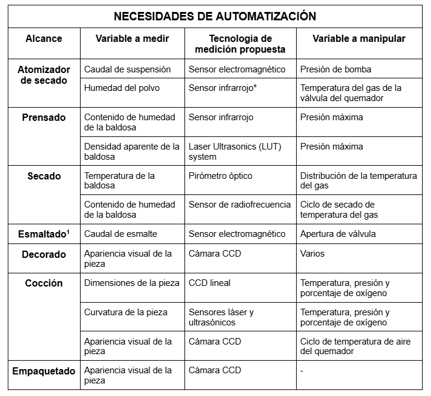

# PLANEACIÓN Y GESTIÓN

## Objetivos y metas

**Objetivo general:** Automatizar una planta de manufactura de baldosas cerámicas que permita la fabricación de tres productos diferentes, mejorando la eficiencia y flexibilidad del proceso.

### Objetivos de Producción:

* Aumentar la producción mensual de baldosas cerámicas en un 15%.
* Mejorar la eficiencia del proceso de producción para reducir los costos operativos en un 10% y aumentar la rentabilidad en un 7%.
* Garantizar la consistencia y calidad del producto final para cumplir con los estándares del mercado y las expectativas de los clientes.

## Descripción del proceso previo a la automatización
Para mayor detalle sobre el funcionamiento del proceso previo a la automatización remitirse a [descripción del proceso productivo sin-automatizar](../producto/1-analisis-disenio.md#descripción-del-proceso-productivo-sin-automatizar)

## Alcance del proyecto

Podemos definir el alcance del proyecto a partir de los siguientes componentes:

### Alcance Funcional:

El proyecto se centrará en la automatización de subprocesos específicos, como el transporte, atomizador de secado, prensado, secado, esmaltado, decoración, cocción y empaquetado, para una línea de producción de baldosas cerámicas con 3 tipos de esmalte: azulejos con **tamaño de 20x20 centímetros** y un **grosor de 10 milímetros**, con esmalte clase 1, 2 y 3. También se diseñará un sistema de supervisión y control del proceso de manufactura, se realizará la instalación de las mejoras realizadas y se conectarán con otros dispositivos y sistemas de manera segura a través de internet. No se incluirán otros procesos no mencionados en esta lista.

### Alcance Tecnológico: 

La automatización se basará en tecnologías disponibles y probadas, con énfasis en la integración de sistemas de control y sensores para monitorear y controlar variables críticas en cada subproceso, desde la implementación de los sistemas de control automatizado hasta su puesta en marcha y validación, incluyendo la programación de lógica de control para los subprocesos identificados que asi lo requieran.

### Alcance Geográfico: 

Se trabajará exclusivamente en un entorno de gemelo digital, sin implementación física en fábrica.

### Alcance de Recursos: 

Se utilizarán los recursos disponibles dentro del presupuesto asignado para el proyecto, incluyendo equipos, software, personal y el tiempo de implementación indicado en el cronograma.

### Compatibilidad con Equipos Existentes: 

La automatización propuesta deberá ser compatible con los equipos y sistemas existentes en la planta de producción.

### Seguridad y Regulaciones: 

La implementación de la automatización deberá cumplir con todas las normativas de seguridad laboral y regulaciones ambientales aplicables.

## Propuesta 

A continuación, se presenta una lista de propuestas para la automatización de una línea de producción de baldosas cerámicas en una empresa mediana con producción anual de 650.000 metros cuadrados.

* Atomizador de Secado:
Implementación de un sistema de control automático que cierre el bucle de control utilizando la señal de medición por infrarrojos para controlar y mantener el contenido de humedad del polvo de manera óptima.
Automatización de la manipulación del caudal de suspensión para garantizar un proceso de atomización eficiente y uniforme.
* Prensado:
Desarrollo e implementación de un sistema de control automático para medir y manipular el contenido de humedad en las piezas durante el proceso de prensado.
Integración de un bucle de control que tenga en cuenta la densidad aparente de las baldosas para optimizar la calidad del producto final.
* Secado:
Instalación de un sistema automatizado para el manejo de la temperatura y el contenido de humedad en las baldosas durante el proceso de secado, garantizando condiciones óptimas de secado para evitar defectos.
* Esmaltado:
Implementación de un controlador automatizado para regular el caudal del esmalte durante el proceso de esmaltado, asegurando una aplicación uniforme y consistente del esmalte en las baldosas.
* Decoración:
Desarrollo e implementación de un sistema de inspección visual automatizada para detectar defectos en las baldosas decoradas, garantizando altos estándares de calidad.
* Cocción:
Automatización de la manipulación de las variables de dimensiones y curvatura de las piezas durante el proceso de cocción, utilizando un sistema de control para ajustar automáticamente los parámetros del horno.
Implementación de un sistema automatizado para la inspección visual y control de temperatura del aire del quemador, asegurando condiciones de cocción consistentes y óptimas.
* Empaquetado:
Mejora del sistema automatizado de empaquetado existente para aumentar la eficiencia y la precisión del proceso de empaquetado de las baldosas cerámicas.

## Entregables:

* Sistema de control cerrado para el contenido de humedad en el Atomizador de Secado.
* Sistema automático de control de humedad y densidad aparente en el Prensado.
* Sistema automatizado de control de temperatura y humedad en el Secado.
* Controlador automatizado del caudal de esmalte en el Esmaltado.
* Sistema de inspección visual automatizada para la Decoración.
* Sistema automatizado de manipulación de valores y control de temperatura en la Cocción.
* Mejora del sistema automatizado de empaquetado.
* Sistema de control, supervisión y adquisición de datos de la línea de producción.
* Conexión e intercambio de datos con otros dispositivos y sistemas a través de internet.

## Exclusiones del Alcance:

* No se incluye la automatización de otros procesos no mencionados, como la preparación de materias primas.
* No se considera la implementación de sistemas de automatización para áreas no relacionadas con la producción de baldosas cerámicas.
* No se abarca la capacitación del personal en el uso y mantenimiento de estos sistemas.

El alcance del proyecto incluirá el diseño, desarrollo, implementación y puesta en marcha de los sistemas automatizados en cada subproceso identificado. Se buscará mejorar la eficiencia, la calidad y la consistencia en la producción de baldosas cerámicas mediante la automatización de procesos clave.

-

### Metas de Eficiencia:

* Reducir el tiempo de ciclo del proceso de producción en un 13%.
* Lograr una utilización de equipos del 85% o más.
* Optimizar el consumo de energía durante el proceso de producción para reducir los costos operativos en un 10%.

### Metas de Calidad:

Reducir la tasa de productos defectuosos por debajo del 2% al finalizar el primer año de implementación del proyecto.
Asegurar la uniformidad del producto final para garantizar que todas las baldosas cerámicas cumplan con las especificaciones de tamaño, grosor y acabado.

Asegurar la consistencia en la absorción de agua de acuerdo con los estándares establecidos para cada tipo de baldosa cerámica.
Recursos

## Recursos Financieros:

Presupuesto para Implementación: Fondos necesarios para adquirir equipos, materiales y software requeridos para la automatización del proceso de producción.
Fondos para Capacitación: Recursos destinados a la capacitación del equipo en el uso de nuevas tecnologías y herramientas relacionadas con la automatización.
Reserva para Contingencias: Fondos adicionales destinados a cubrir gastos imprevistos o cambios en los requisitos del proyecto.
Costos Operativos: Fondos necesarios para cubrir los costos operativos del proyecto, como electricidad, mantenimiento y otros gastos misceláneos.

## Recursos Humanos y Capacitación:

* *Equipo de Implementación:* Ingenieros mecatrónicos con habilidades en diseño, programación, electrónica y automatización industrial.
* *Supervisores del Proyecto:* Será necesario contar con la supervisión y orientación de profesores con experiencia en áreas relacionadas, quienes guiarán y supervisarán el progreso del proyecto.
* *Capacitación en Nuevas Tecnologías:* El equipo de estudiantes necesitará capacitación en el uso de tecnologías específicas, como software de diseño CAD, software de control de procesos, y sistemas de automatización.
* *Desarrollo de Habilidades blandas:* Se requerirá capacitación adicional para desarrollar habilidades de trabajo en equipo, gestión de proyectos, resolución de problemas y comunicación efectiva.
* *Capacitación en Seguridad:* Programas de capacitación en seguridad laboral y manejo de equipos de automatización para garantizar un entorno de trabajo seguro.
* *Asistencia Técnica:* Posibilidad de contar con asistencia técnica externa para resolver problemas técnicos complejos o para optimizar el funcionamiento de los sistemas automatizados.
