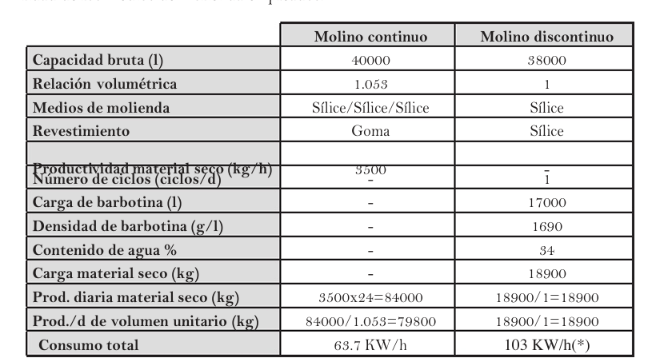
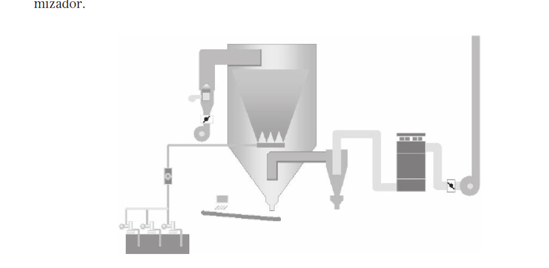
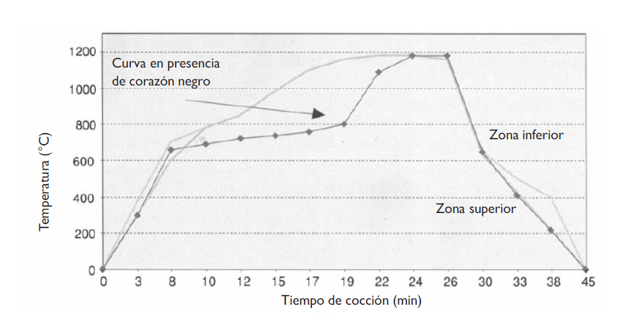
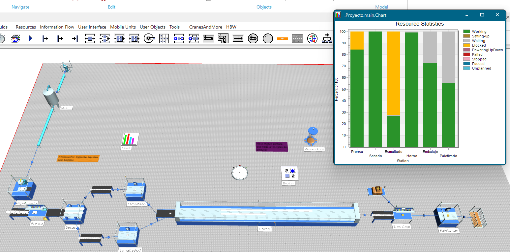

# Analisís y  diseño


## Descripción del proceso productivo previo a intervencion

El proceso de la producción de baldosas cerámicas consta de las siguientes etapas:


### Molienda

En el proceso de molienda, las materias primas (arcilla 40-60%, feldespatos  20-30%, arenas 10-20% , carbonatos 5-10% y caolines 1-5%) se dosifican en proporciones específicas y se introducen en el molino MTC 041 [[1](#referencias)]. Basado en su capacidad de 40000 litros y la tabla de caracteristicas estandar de de un molino se tiene que tiene una producción de 3500 kg/hora de material seco equivalente **5300 kg/h** barbotina con 34% de humedad o **1.473 kg/h** barbortina humeda.  

Dentro del molino, estos materiales se mezclan con agua y defloculantes, resultando en la formación de la barbotina, un compuesto líquido crucial para la fabricación de azulejos. La automatización de este proceso implica varios componentes y técnicas avanzadas.
Las materias primas se transportan mediante un sistema de bandas transportadoras. Cada banda transportadora se ajusta individualmente para controlar la velocidad, lo que permite dosificar con precisión las proporciones de cada material. Estas bandas convergen en una banda transportadora común que lleva los materiales mezclados hacia el molino. Dentro del molino, un sensor de humedad infrarrojo mide continuamente el contenido de humedad de la barbotina. Este sensor emite datos en tiempo real a un sistema de control automatizado. Basándose en estas mediciones, el sistema ajusta una válvula de control de agua para mantener la humedad de la barbotina dentro de los parámetros especificados. Este ajuste se realiza mediante un actuador que regula la apertura y cierre de la válvula, asegurando una adición precisa de agua. La densidad de las barbotinas varía de 1690 a 1740 g/l [2]. En la molienda la barbotina sale con una humedad del 34% [[2](#referencias)].


{width=80%}


{width=80%}
> Tomado de [1] pag 15

| dimension | units   | MTC-035 | MTC-041 |
|-----------|---------|---------|---------|
| A         | mm      | 10935   | 12230   |
| B         | mm      | 3570    | 3570    |
| C         | mm      | 4070    | 4070    |
| D         | mm      | 2200    | 2200    |
| E         | mm      | 2900    | 2900    |
| F         | mm      | 9255    | 10550   |


{width=80%}
> Tomado de [2] pag 68


### Atomizado

En el proceso de atomización, se inicia con la introducción de la barbotina obtenido del paso anterior en un cilindro cerrado, donde se expulsa mediante aspersión en un entorno controlado con corrientes de aire caliente. Esta operación provoca la reducción de la humedad de la barbotina, llevándolo a un estado sólido. Posteriormente, por efecto de la gravedad, el sólido resultante cae sobre una cinta transportadora que lo dirige hacia el siguiente proceso de fabricación. Se tiene que la planta cuenta con un atomizador ATM018 con una capacidad de producción de polvo atomizado de **4.240 kg/hora** de polvo con humedad del 6% que representa 3985 kg/hora de polvo seco [[3](#referencias)]. Pero se ve limitado por la capacidad del molino 

{width=80%}
> Tomado de [2]


| DATOS TÉCNICOS                                   |          | ATM006  | ATM012    | ATM018    | AMT036    | ATM052    | ATM065    |
|--------------------------------------------------|---------|----------|-----------|-----------|-----------|-----------|-----------|
| Capacidad de evaporación nominal (a 0 mslm)      | l/h     | 600      | 1.200     | 1.800     | 3.600     | 5.200     | 6.500     |
| Producción atomizado (@ 34% H2O)                 | kg/h    | 1.410    | 2.830     | 4.240     | 8.490     | 12.260    | 15.320    |
| Potencia térmica nominal instalada               | kcal/h  | 540.000  | 1.050.000 | 1.500.000 | 3.000.000 | 4.300.000 | 5.500.000 |
| Temperatura aire en entrada a la torre           | °C      | 500-600  | 500-600   | 500-600   | 500-600   | 500-600   | 500-600   |
| Temperatura aire en salida                       | °C      | 60-130   | 60-130    | 60-130    | 60-130    | 60-130    | 60-130    |
| Temperatura polvo atomizado                      | °C      | 40-60    | 40-60     | 40-60     | 40-60     | 40-60     | 40-60     |
| Humedad polvo atomizado                          | %       | 4-7      | 4-7       | 4-7       | 4-7       | 4-7       | 4-7       |
| Consumo térmico específico                       | kcal/l  | 750-850  | 700-850   | 700-850   | 700-850   | 700-850   | 700-850   |
| Número de LANZAS                                 | n.      | 3        | 6         | 7         | 9         | 10        | 12        |
| Boquillas - número máximo con LANZAS             | n.      | 6        | 12        | 14        | 18        | 20        | 24        |
| Boquillas - número máximo con CORONA             | n.      | 6        | 12        | 15        | 20        | 28        | 32        |
| Ciclones separadores                             | n°      | 1        | 1         | 1         | 2         | 2         | 2         |
| Potencia eléctrica nominal instalada             | kW      | 14,0     | 22,5      | 35,5      | 63,5      | 90,0      | 125,0     |


| DATOS TÉCNICOS                              |        | ATM090 | ATM110 | ATM140 | AMT180 | ATM200 | ATM250 |
|---------------------------------------------|--------|--------|--------|--------|--------|--------|--------|
| Capacidad de evaporación nominal (a 0 mslm) | l/h    | 9,000  | 11,000 | 14,000 | 18,000 | 20,000 | 25,000 |
| Producción atomizado (@ 34% H2O)            | kg/h   | 21,210 | 25,930 | 33,000 | 42,430 | 47,140 | 58,930 |
| Potencia térmica nominal instalada          | kcal/h | 7,500M | 9,200M | 11,500M| 15,000M| 16,700M| 21,000M|
| Temperatura aire en entrada a la torre      | °C     | 500-600| 500-600| 500-600| 500-600| 500-600| 500-600|
| Temperatura aire en salida                  | °C     | 60-130 | 60-130 | 60-130 | 60-130 | 60-130 | 60-130 |
| Temperatura polvo atomizado                 | °C     | 40-60  | 40-60  | 40-60  | 40-60  | 40-60  | 40-60  |
| Humedad polvo atomizado                     | %      | 4-7    | 4-7    | 4-7    | 4-7    | 4-7    | 4-7    |
| Consumo térmico específico                  | kcal/l | 700-850| 700-850| 700-850| 700-850| 700-850| 700-850|
| Número de LANZAS                            | n.     | 12     | 13     | 14     | 18     | 18     | 24     |
| Boquillas - número máximo con LANZAS        | n.     | 24     | 26     | 28     | 36     | 36     | 48     |
| Boquillas - número máximo con CORONA        | n.     | 32     | 40     | 48     | -      | -      | -      |
| Ciclones separadores                        | n°     | 2      | 4      | 4      | 4      | 4      | 6      |
| Potencia eléctrica nominal instalada        | kW     | 150.5  | 182    | 230    | 355.5  | 355.5  | 407    |
> Tomado de [3]

 
<!--
>La capacidad de evaporación es el parámetro característico del atomizador que con más inmediatez permite verificar la eficacia y el grado de rendimiento de la máquina, con respecto a su potencial.  
> pag 101 
-->


### Prensado 

En este proceso, el polvo atomizado resultante de la etapa de atomización se distribuye uniformemente en una bandeja, donde se aplica una fuerza entre 340 y 400 kg/cm² mediante una prensa hidráulica. Esta fuerza provoca que la humedad residual en el polvo facilite la formación de la pieza con una forma geométrica específica, en este caso, un cuadrado de 20x20 centímetros. La pieza se conforma mediante la compactación del polvo granulado semiseco. El proceso utiliza una prensa  SACMI PH2090 esta cuenta con molde tiene un area de trabajo de un 100x60 cm donde se elaboran 15 baldosas por cada ciclo. La prensa realiza 14 ciclos por minuto equivalente a un periodo de **4.29 s por golpe** [[4](#referencias)]. 

La cantidad de material que entra a la prensa se define a partir del molino quien limita la entrada a 3500 kg/h de material seco alrededor de **3700 kg/h** barbotina con 6% de humedad **1.03 kg/s**. Basado en la ficha técnica de piso pared Egeo blanco de Corona cada baldosa pesa tiene un peso aproximado de 327 g [[5](#referencias)]. La prensa a su máxima capacidad puede producir 12600 baldosas/hora que equivalen a un peso aproximado de 4120 kg/hora. Por lo que no trabaja a su máxima capacidad. Basado en la capacidad limitada dle molino se logran producir **11300 baldosas/hora**.
<!--
-->


{width=80%}
> Tomado de [2] pag 166 a 173


### Secado: 

En el proceso de secado se busca eliminar la humedad de las baldosas cerámicas. La cual se reduce de un 6% a un 0.5%. 
Durante el secado se realiza una transferencia de calor desde el ambiente al cuerpo cerámico a secar lo que produce la evaporación del agua.  Los secadores horizontales son de tipo horno monoestrato de rodillos. En este caso las piezas se mueven por encima de los rodillos en horizontal y el aire caliente con el que entran en contacto viene de quemadores que están en los laterales del horno. La temperatura máxima de este tipo de secadores está en los 350oC y los ciclos de secado son menores, entre 15 y 25 minutos. 


{width=80%}

Basado en la ecuación de secado se tiene que el tiempo de secado es de 18 minutos. 

```  
SECADO	
Teo : tiempo de secado en minutos	
Teo = (S)^3/2 + (0.02 × Lm) × Ko	
Ko : coeficiente del material	0.55 gres porcelánico
S : espesor total mm	6,4mm
Lm : lado mayor en mm	200
	
Teo : tiempo de secado en minutos	18.4
```


### Esmaltado y decoración:

El esmaltado es un tratamiento que se utiliza para otorgar una serie de propiedades tecnicas y estéticas como la impermeabilidad, facilidad de limpieza, brillo, color,resistencia química y mecánica etc. El esmaltado se realiza en continuo y los métodos más empleados son: por pulverización, en cortina, en seco o las decoraciones.

Al aplicar las capas de esmalte en el soporte cerámico convierten en un recubrimiento compacto de partículas denominado capa consolidada. La serigrafía es el método más empleado para la decoración de baldosas cerámicas por su facilidad de aplicación en las líneas de esmaltado. Se usa en monococción, bicocción y tercer fuego. Durante el proceso de esmaltado La velocidad de transporte es de aproximadamente 20-25 m/min. Existen varios tipos de esmaltado como lo son campana, hilera, discos rotatorios, aerógrafo y sistemas de goteo. Se establece que el tipo de esmaltadora es por campana y se tienen 2 esmaltadoras. Teniendo en cuenta que la velocidad de la banda es de 20 m/min se establece que por cada minuto pasan 80 baldosas por cada esmaltadora por lo que entre ambas **9600 baldosas por hora** equivalente a  un periodo de 0.75 seg por baldosa . el esmaltado  pasa por una  Para el decorado se utiliza un sistema de serigrafía el cual por.

```	
f = 4300 u/h 
T = 1/f 
T = 1/(4300 [u/h]) (3600 s/h) 
T = 0.75 s/u
```	

### Cocción:

Dentro del proceso de producción es la etapa más importante ya que es el momento en el que las piezas tienen una gran transformación, dando como resultado piezas con grandes características como resistencia al agua, dureza, facilidad de limpieza, estabilidad dimensional.

Dos variables fundamentales en esta etapa son el ciclo térmico y la atmósfera del horno, que deben adaptarse a las características específicas de cada composición y tecnología de fabricación para obtener el producto cerámico deseado.

La etapa de cocción se divide en dos partes principales: calentamiento y enfriamiento. Durante la etapa de calentamiento, que abarca aproximadamente el 55-60% de la longitud del horno, las piezas se calientan gradualmente hasta alcanzar alrededor de 400°C. Este calentamiento inicial tiene como objetivo eliminar la humedad excesiva y los humos generados durante la combustión. Luego, se produce un aporte energético que facilita la oxidación de la materia orgánica y las impurezas, eliminando los gases generados y descomponiendo los carbonatos presentes en el soporte cerámico.

Es crucial que estas reacciones se completen antes de que la permeabilidad del esmalte y el soporte sea demasiado baja, lo que podría causar problemas como alteraciones de color o textura en las piezas. La etapa de cocción propiamente dicha es donde ocurre la sinterización de las piezas. Durante este proceso, el soporte cerámico experimenta una transformación química, pasando de una mezcla de materias primas a una estructura más compleja, con fases vitreas o cristalinas estables, dependiendo del tipo de composición.

El tiempo necesario en esta etapa es crucial para garantizar la vitrificación completa de la pieza y asegurar su estabilidad dimensional. Las temperaturas alcanzadas pueden oscilar entre 1130°C y 1200°C. Durante esta fase, y al final del calentamiento, las piezas experimentan una importante variación dimensional debido a la dilatación térmica, lo que debe ser considerado en el diseño de la pasta, el englobe y el esmalte para evitar problemas de curvatura en el producto final.

La etapa de enfriamiento, que comprende entre el 40% y el 50% de la longitud del horno, consta de tres etapas distintas: enfriamiento forzado a alta temperatura, enfriamiento natural y enfriamiento forzado a baja temperatura. Durante estas etapas, se utilizan diferentes métodos de enfriamiento para garantizar que las piezas se enfríen de manera controlada, minimizando así la posibilidad de roturas o defectos en el producto final. La transformación alotrópica del cuarzo a 537°C es un aspecto importante que se debe considerar durante el enfriamiento, ya que puede provocar roturas si no se controla adecuadamente.

Las dimensiones y curvatura de las piezas se miden de forma automática, pero la manipulación de los valores que determinan estas variables es manual. Se propone automatizar la manipulación de éstas. Adicionalmente, la inspección visual y control de temperatura del aire del quemador se realizan manualmente. Se propone su automatización.


> Tomado de [2] pag 218

A partir de la grafica del ciclo de calentamiento del horno se sabe que el proceso de cocción dura 55 min.


### Empaquetado:

La clasificación y el embalaje es la penúltima etapa del proceso de fabricación de baldosas cerámicas. Se establece que la planta hace este proceso de forma manual donde la inspección se realiza de forma visual por los operarios los cuales seleccionan y empaquetan 35 baldosas por caja de empaquetado. Se tiene que la planta produce 275 cajas/hora  4.5 cajas/min equivalente a **13 seg por cajas**. En la estación se tienen 2 operarios que realizan el proceso de empaquetado.

### Paletizado:

El ultimo paso del proceso consiste en el al agrupación de cajas de baldosas para formar un paletizado donde se prepara el producto para su transporte. Este proceso se realiza de forma manual a traves de un operario.

## Estado de la planta:

Se tiene que la fabrica opera por 2 turnos de 8 horas al dia 6 días a la semana. Donde se produce en promedio 8000 baldosas/hora lo que equivale a 228 cajas/hora. 

## VSM (Value Stream Mapping)

Basado en la información anterior se realizó un mapa de flujo de valor para identificar los procesos con mayor potencial de mejora y candidatos a ser automatizados. Para esto se utilizo la herramienta de tecnomatix.




## Cuellos de botella y áreas de mejora 

> Entre las 588 muestras obtenidas, los defectos incluyen tipos de grietas (60,9%), esquinas rotas (9,9%), defectos de impresión y decoración (9,4%), bordes rotos (8%), defectos en el esmaltado inferior (5,4%), sombras ( 3,9%) y otros casos (2,6%). Teniendo en cuenta las cuestiones anteriores, se analizó el parámetro de tipos de grietas como la principal causa de creación de defectos en las baldosas, que se asoció con las máquinas de prensado

## Indicadores claves de diseño


<embed src="/Tile-Tech/KPI.pdf" type="application/pdf" width="100%" height="600px" />

[KPI](/KPI.pdf)


## Modelos usado en el diseño
- caja de empaque tomado de [Cardboard Insert](https://grabcad.com/library/cardboard-insert-1)


## Referencias

1. Catálogo  de molinos de tambor continuo SACMI. [Catalogo de molinos SACMI](/catalogos/1molienda_catalogo_Molino_MTC_SACMI.pdf)
2. Tecnología cerámica aplicada SACMI, Asociación Española de Técnicos Cerámicos. 2004.[SACMI](https://sacmi.com/)
3. Preparacion de polvos ceramicos atomizacion.[SACMI](https://sacmi.com/es-ES/ceramics/Azulejos/Preparacion-de-polvos-ceramicos/atomizacion/ATM)
4. [Catalogo de prensa SACMI](/catalogos/1prensado_catalogo_prensa_SACMI.pdf) 
5. [ ficha técnica Egeo blanco de Corona](/catalogos/1productos_baldosas.pdf)
