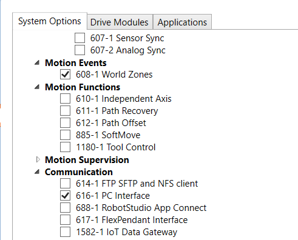

# Integración de sistemas

## Comunicaciones

La integración entre todas las partes se realizó mediante comunicación OPC utilizando ignition.

ABB IRC5 OPC server

Se realiza la  conexión entre NX studio 5000 y robotstudio mediante el servidor OPC UA de ABB. Se configura el servidor OPC UA en el controlador virtual de robotstudio y se configura el cliente OPC UA en NX studio 5000.

## Referencias
1. ABB. ROBOTICS Application manual IRC5 OPC UA Server. [url](https://library.e.abb.com/public/68db219ad97b4119b1d42170a2872a5a/3HAC074394%20AM%20IRC5%20OPC%20UA%20Server-en.pdf?x-sign=7vOawlpdLe4GAn5sgyapqq6/5bffcJv9AdDpI9HIY5SZRDfU/d6wXwSl1NfE9bSC)
2. ABB. Product specification Robot User Documentation. [url](https://library.e.abb.com/public/f25a4accfbd64f9fc1257b4b0052188a/3HAC024792-001_rev-_en_library.pdf)