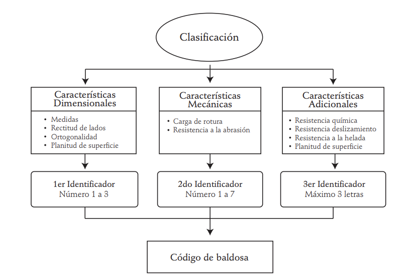

# Definición de productos

Se propone como prducto tres tipos diferentes de baldosas de porcelana todas con **tamaño de 20x20 centímetros** , un **grosor de 5.7 $\pm$ 0.3 milímetros**  (se toma como valor nominal el espesor máximo admisible de 6 mm) y un peso de baldosa de 522 g. Las baldosas son empacadas en cajas de 25 baldosas.  Estas cajas de baldosas son empacadas en palets de 80 cajas

Baldosas cerámicas con 3 tipos de esmalte: con esmalte clase 1, 2 y 3.
<!--
(19.8x19.8)
-->

| Tipo        | PISO PARED EGEO BLANCO | PARED ADRIÁTICO AZUL CLARO | (N)CER  PRISMA MENTA                |
|-------------|------------------------|----------------------------|-------------------------------------|
| Decorado    |      |          |                   |
| Formato     | 20x20x6 cm             | 20x20x6 cm                 | 20x20x6 cm                          |
| Peso        | 522 g                  | 522 g                      | 522 g                               |
| Esmalte     | clase 1                | clase 2                    |  clase 3                            |
| Acabado     | mate                   | brillante                  |  brillante                          |
| Baldosas/caja | 25                   | 25                         | 25                                  |
| Baldosas/estiba | 80                 | 80                         | 80                                  |
| Uso         | Residencial   baños    | Residencial bajo trafico   | Residencial cocina                  |

## Referencias

Los productos adaptados de los siguientes catálogos de productos de corona:

* [Catálogo producto 1](/catalogos/1productos_baldosa.pdf) 
* [Catálogo producto 2](/catalogos/1productos_baldosa2.pdf) 
* [Catálogo producto 3](/catalogos/1productos_baldosa3.pdf) 

<!--

<embed src="/Tile-Tech/catalogos/1productos_baldosa.pdf" type="application/pdf" width="100%" height="400px" />

<embed src="/Tile-Tech/catalogos/1productos_baldosa2.pdf" type="application/pdf" width="100%" height="400px" />

<embed src="/Tile-Tech/catalogos/1productos_baldosa3.pdf" type="application/pdf" width="100%" height="400px" />
-->
