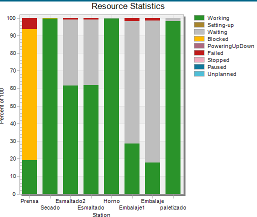

# Gestion de producción 

El analisis de la gestion de producción sera realizado utilizando la herramienta de tecnomatix, la cual permite simular el proceso de produccion de la empresa antes y despues de la intervención.

## VSM (Value Stream Mapping)

Basado en la información anterior se realizó un mapa de flujo de valor para identificar los procesos con mayor potencial de mejora y candidatos a ser automatizados. Para esto se utilizo la herramienta de tecnomatix.

## Simulación de la planta previo a la intervención

## Simulación de la planta posterior a la intervención 

## Cuellos de botella y áreas de mejora 

## Calidad 
> Entre las 588 muestras obtenidas, los defectos incluyen tipos de grietas (60,9%), esquinas rotas (9,9%), defectos de impresión y decoración (9,4%), bordes rotos (8%), defectos en el esmaltado inferior (5,4%), sombras ( 3,9%) y otros casos (2,6%). Teniendo en cuenta las cuestiones anteriores, se analizó el parámetro de tipos de grietas como la principal causa de creación de defectos en las baldosas, que se asoció con las máquinas de prensado
> Tomado de [1]

Basado en lo anterior iniciando con un parámetro de calidad estimado de 90% se obtiene la calidad correspondiente a cada uno de cada uno de los procesos según su respectiva prevalencia en los defectos encontrados por el reporte:

* grietas -> prensado : Q = 93.90 %
* esquinas rotas, bordes rotos -> empaquetado: Q = 98.1%
* defectos de impresión y decoración -> decoración : Q = 99.06%
* defectos en el esmaltado inferior, sombras -> esmaltado: Q =99.07%
* otros casos ->  molienda: Q = 99.85% atomizado: Q = 99.85%, secado: Q = 99.85%, cocción: Q = 99.85% 

$Q_A = 0.9390 * 0.981 * 0.9906 * 0.9907 * 0.9985^4 = 0.8986$

## Indicadores claves de diseño

<embed src="/Tile-Tech/KPI.pdf" type="application/pdf" width="100%" height="600px" />

[KPI](/KPI.pdf)

## Reporte de tecnomatix previo a intervención
<iframe src="/Tile-Tech/report_tecnomatix_previous.pdf" type="application/pdf" width="100%" height="600px" ></iframe>

## Reporte de tecnomatix posterior a intervención
<iframe src="/Tile-Tech/report_tecnomatix_after.pdf" type="application/pdf" width="100%" height="600px" ></iframe>

<iframe src="/Tile-Tech/tecnomatix_report.html"  width="90%" height="400" frameborder="0" allowfullscreen></iframe>

## Modelos usado en el diseño
- caja de empaque tomado de [Cardboard Insert](https://grabcad.com/library/cardboard-insert-1)

## Referencias
1. 