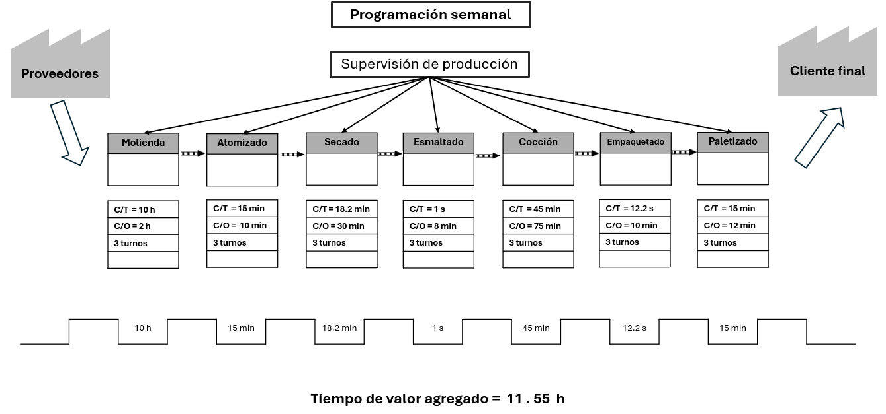
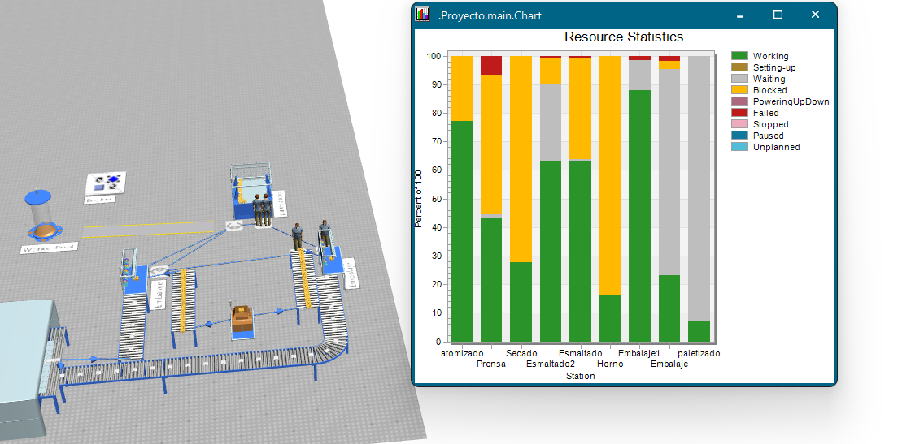
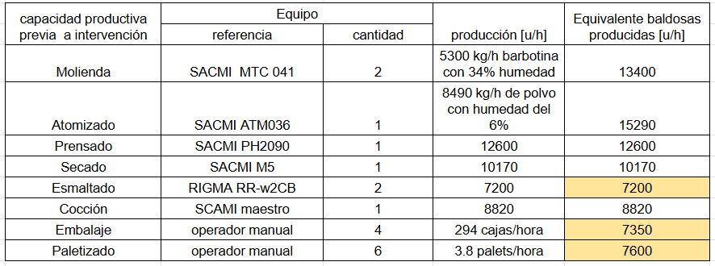
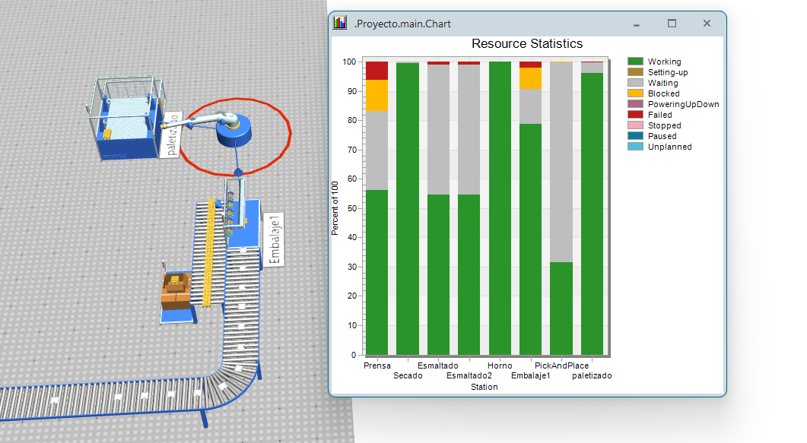
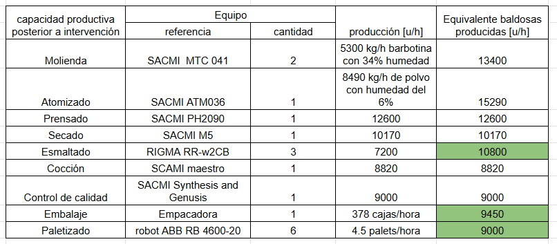

# Gestión de producción 

El análisis de la gestión de producción se realiza utilizando la información recopilada sobre la [capacidad productiva de cada proceso](1-analisis-disenio#etapas-del-proceso-productivo).

## VSM (Value Stream Mapping)
Basado en la información previa se puede establecer los tiempos de ciclo (T/C) y los change over o setup times (C/O) que requieren cada proceso. Por facilidad estos son representados en un un mapa de flujo de valor para identificar los procesos con mayor potencial de mejora y candidatos a ser automatizados.

## Calidad 

Basado en el siguiente reporte y tomando un parámetro de calidad estimado de 90% se obtiene la calidad correspondiente a cada uno de cada uno de los procesos según su respectiva prevalencia en los defectos encontrados por el reporte:

> Entre las 588 muestras obtenidas, los defectos incluyen tipos de grietas (60,9%), esquinas rotas (9,9%), defectos de impresión y decoración (9,4%), bordes rotos (8%), defectos en el esmaltado inferior (5,4%), sombras ( 3,9%) y otros casos (2,6%). Teniendo en cuenta las cuestiones anteriores, se analizó el parámetro de tipos de grietas como la principal causa de creación de defectos en las baldosas, que se asoció con las máquinas de prensado
> Tomado de [1]

* grietas -> prensado : Q = 93.90 %
* esquinas rotas, bordes rotos -> empaquetado y paletizado: Q = 98.1%
* defectos de impresión y decoración -> decoración : Q = 99.06%
* defectos en el esmaltado inferior, sombras -> esmaltado: Q =99.07%
* otros casos ->  molienda: Q = 99.85% atomizado: Q = 99.85%, secado: Q = 99.85%, cocción: Q = 99.85% 

$Q_A = 0.9390 * 0.981 * 0.9906 * 0.9907 * 0.9985^4 = 0.8986$

Cabe destacar que las baldosas que tienen defectos de fabricación son reutilizadas ingresando como materia prima en el proceso de molienda.

## Availability

La disponibilidad o availability hace referencia a la capacidad de un sistema de estar operativo en un momento dado. Se calcula mediante la siguiente fórmula:

$$A = \frac{MTBF}{MTBF +MTTM} $$

Siendo MTBF el tiempo medio entre fallos y MTTM el tiempo medio de mantenimiento o reparación.

Basado en la investigación sobre paradas se tiene un  promedio de un 1 dia de parada mes. Por lo que los cálculos de producción se realizan en base a 29 días de operación. 

$$A = \frac{29*24}{29*24 + (8 + 1*24)} = 0.956$$

Obteniendo un resultado de un availability del 95.6%. Se asume que la disponibilidad de cada proceso es la misma.

Una vez establecidos estos parámetros se realiza la simulación del proceso utilizando la herramienta *Tecnomatix* y se observa la interacción de los procesos en su conjunto.

## Simulación de la planta previo a la intervención

## Cuellos de botella y áreas de mejora 

En la siguiente tabla se puede ver la capacidad de producción de cada proceso:

Esto nos permite identificar que los cuellos de botella se encuentran en los procesos de esmaltado, empaquetado y paletizado.

Viendo que el cuello de botella que restringe el proceso se encuentra en el esmaltado se establece el volumen real de producción de la planta. Para ello se  calcula la reducción de capacidad causada por perdidas debido a la calidad a la disponibilidad de la fábrica. Para la calidad no se toma el valor de calidad general de la planta ya que perdidas por calidad en procesos anteriores a la esmaltadora pueden compensarse con la capacidad excedente de producción que se tiene en estos procesos. Se calcula la calidad a partir del esmaltado que incluye los procesos de decorado, cocción y empaquetado obteniendo una calidad de 96.13%.

$$ Q = 0.9907*0.9906*0.9985*0.981=0.9613$$

Se obtiene como resultado una producción bruta de  **190.564 [m^2/mes]** de baldosas mensuales.

## Simulación de la planta posterior a la intervención 

Después de realizar la [propuesta de automatización](4-propuesta) se realiza una nueva simulación de la planta con los nuevos procesos mejorados obteniendo los siguientes resultados.

Se establece el nuevo volumen real de producción de la planta. Para ello se observa que el nuevo cuello de botella se encuentra en el horno.  Se calcula la reducción de capacidad causada por perdidas debido a la calidad a la disponibilidad de la fabrica. Se mide la calidad a partir del horno donde intervienen el proceso de cocción, empaquetado y paletizado obteniendo una calidad de 97,95%. y se  tiene la misma disponibilidad del 95.6%.

$$ Q = 0.9985*0.981=0.9795$$

A continuación se muestra un video donde se evidencia la simulación de la planta en su totalidad tanto antes como después de la intervención permitiendo comparar su producción resultante.

<iframe width="560" height="315" src="https://www.youtube.com/embed/2vX36CS_SRg?si=4c0oOeXH0hdLJu_p" title="YouTube video player" frameborder="0" allow="accelerometer; autoplay; clipboard-write; encrypted-media; gyroscope; picture-in-picture; web-share" referrerpolicy="strict-origin-when-cross-origin" allowfullscreen></iframe>

## Indicadores claves de diseño

<embed src="/Tile-Tech/KPI.pdf" type="application/pdf" width="100%" height="600px" />

[KPI](/KPI.pdf)

A continuación se anexan los reportes de la simulación de la planta antes y después de la intervención.

## Reporte de tecnomatix 

  
 Anexo reporte de tecnomatix previo a intervención 

<iframe src="/Tile-Tech/report_tecnomatix_previous.pdf" type="application/pdf" width="100%" height="600px" ></iframe>

  
 Anexo reporte de tecnomatix posterior a intervención 

<iframe src="/Tile-Tech/report_tecnomatix_after.pdf" type="application/pdf" width="100%" height="600px" ></iframe>

<!---
## Modelos usado en el diseño
- caja de empaque tomado de [Cardboard Insert](https://grabcad.com/library/cardboard-insert-1)
-->

## Referencias

1. 