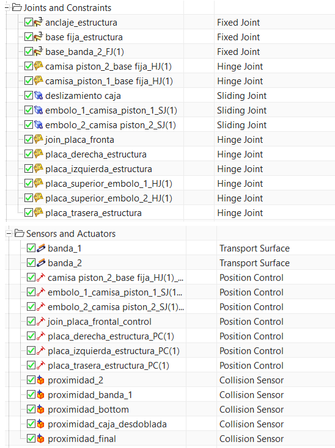
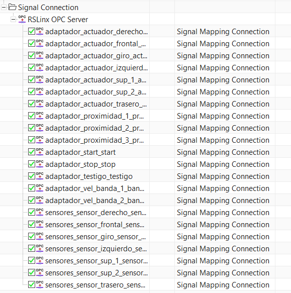
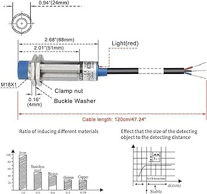

# Digital Factory

Se presenta el desarrollo de la simulación de una fábrica digital desarrollado en NX.

## Gemelo digital

Se realizó el gemelo digital de una máquina de empacado de baldosas, en el cual se simula el proceso y se maneja la actuación a través de comunicación OPC mediante ignition conectando NX con un controlador PLC simulado. La lógica es desarrollada usando lenguaje ladder para determinar las subrutinas, las cuales fueron desarrolladas en GRAFCET. Este tipo de programación facilita el desarrollo de rutina complejas mediante la representación gráfica de las mismas.

{width=60%}

{width=60%}

A continuación se presenta la demostración del funcionamiento de las etapas desarrolladas en NX.

<iframe width="560" height="315" src="https://www.youtube.com/embed/Azf9Fd5UB84?si=1J0MO_XdI1FadSqF" title="YouTube video player" frameborder="0" allow="accelerometer; autoplay; clipboard-write; encrypted-media; gyroscope; picture-in-picture; web-share" referrerpolicy="strict-origin-when-cross-origin" allowfullscreen></iframe>

Cada estación se trabajó en un archivo independiente, a fin de tener modularidad e independencia entre las mismas. Gracias a lo anterior el control y la puesta en marcha puede desarrollarse por etapas, sin tener que enfrentar la complejidad y el peso computacional de todas las escenas en simultáneo. Se realiza la integración de las rutinas de cada estación en el archivo `ceramic_plant.prt` obteniendo la planta completa como se observa en la imagen.

{width=60%}

## Estación de calidad

<iframe width="560" height="315" src="https://www.youtube.com/embed/VFhoQvjKN2s?si=fqOdf4wdI7cqqDPs" title="YouTube video player" frameborder="0" allow="accelerometer; autoplay; clipboard-write; encrypted-media; gyroscope; picture-in-picture; web-share" referrerpolicy="strict-origin-when-cross-origin" allowfullscreen></iframe>

# Aqui sale el Chamote

<!--

{width=60%}
-->