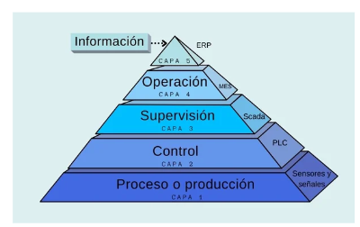

### Industria 4.0: Transformación Digital en la Industria Cerámica

La Industria 4.0, o Cuarta Revolución Industrial, ha traído consigo una transformación significativa en diversos sectores, incluida la industria cerámica. Esta evolución se basa en la integración de tecnologías digitales avanzadas que permiten optimizar y revolucionar los procesos de producción. La industria cerámica, tradicionalmente caracterizada por métodos de producción manuales y semi-automatizados, ha experimentado una metamorfosis considerable gracias a la digitalización. A continuación, se detalla cómo la Industria 4.0 está moldeando el futuro de la producción cerámica.

- Proceso: se logró mejorar la capacidad de producción mediante la instalación de nuevas máquinas y sensores en la línea de producción.

- Control: se tiene la medida de las variables de control de las diferentes etapas del proceso usando los sensores internos de las máquinas, controlador de la celda robótica y de la empacadora.

- Supervisión: No se implementó en el proyecto un sistema SCADA pero las variables de proceso están disponibles fácilmente para la implementación futura del mismo.

- Operación: Desde un principio se asume que la fábrica debido a su tamaño ya cuenta con un software MES para el seguimiento y planeación de la manufactura, sólo es necesario ajustarlo de acuerdo a las nuevas capacidades.

- Información: actualmente no hay integraciones o análisis automático de las mismas

#### Elementos Clave de la Industria 4.0 en la Cerámica

1. **Interconectividad y IoT**: La Internet de las Cosas (IoT) permite conectar máquinas y sistemas de producción cerámicos. Sensores inteligentes y dispositivos conectados recopilan datos en tiempo real, proporcionando información crucial sobre el estado de las máquinas, el consumo de energía y el progreso de la producción. Esta interconectividad facilita el monitoreo continuo y el mantenimiento predictivo, reduciendo tiempos de inactividad y costos operativos.

2. **Automatización Avanzada**: La robótica y la automatización han transformado las líneas de producción cerámica. Robots avanzados se encargan de tareas repetitivas y peligrosas, como la manipulación de materias primas y el esmaltado, aumentando la eficiencia y la seguridad. La automatización también permite una mayor precisión en el control de calidad, asegurando productos finales homogéneos y de alta calidad.

3. **Análisis de Datos y Big Data**: La capacidad de recopilar y analizar grandes volúmenes de datos es fundamental en la Industria 4.0. En la industria cerámica, el análisis de datos puede identificar patrones y tendencias en el proceso de producción, optimizando el uso de recursos y mejorando la toma de decisiones. La inteligencia artificial y el aprendizaje automático se utilizan para predecir fallos en el equipo y optimizar los procesos de producción.

#### Beneficios de la Transformación Digital en la Industria Cerámica

1. **Eficiencia y Productividad**: La automatización y el análisis de datos mejoran significativamente la eficiencia de la producción, reduciendo tiempos de ciclo y aumentando la productividad.

2. **Calidad y Consistencia**: La precisión en el control de calidad y la personalización de productos mediante impresión 3D aseguran productos de alta calidad y consistencia.

3. **Sostenibilidad**: La optimización del uso de recursos y la reducción de desperdicios hacen que los procesos sean más sostenibles, alineándose con las crecientes demandas de responsabilidad ambiental.

4. **Flexibilidad y Personalización**: La capacidad de adaptar rápidamente los procesos y personalizar productos según las demandas del mercado otorga a las empresas cerámicas una ventaja competitiva.

5. **Seguridad y Mantenimiento**: La interconectividad y el monitoreo continuo mejoran la seguridad laboral y permiten un mantenimiento predictivo, reduciendo fallos inesperados y tiempos de inactividad.

### Conclusión

La Industria 4.0 está revolucionando la industria cerámica, transformando sus procesos tradicionales en operaciones más eficientes, flexibles y sostenibles. La adopción de tecnologías digitales no solo mejora la calidad y la productividad, sino que también posiciona a las empresas cerámicas en la vanguardia de la innovación industrial. La transformación digital es, sin duda, el camino hacia un futuro más brillante y competitivo para el sector cerámico.
