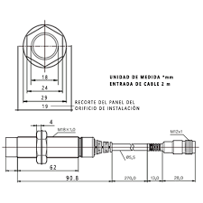

## Transformación digital industria 4.0

Para abordar la temática de la transformación digital en la industria 4.0, se propone la implementación de un gemelo digital con NX.

Se realizo la 

<iframe width="560" height="315" src="https://www.youtube.com/embed/OOryg0T-8Ps?si=zwQEkovh5ce04zeW" title="YouTube video player" frameborder="0" allow="accelerometer; autoplay; clipboard-write; encrypted-media; gyroscope; picture-in-picture; web-share" referrerpolicy="strict-origin-when-cross-origin" allowfullscreen></iframe>

{width=60%}

